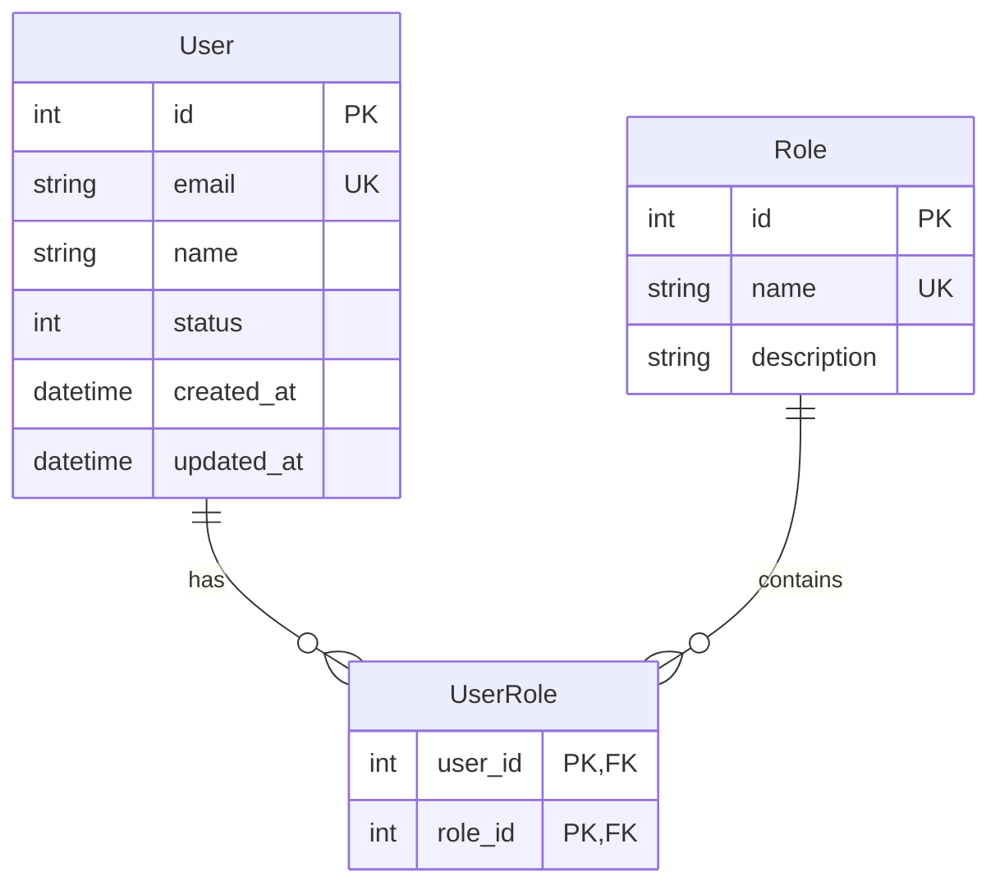

## Purpose

Generate a complete API specification document (`docs/api-first/{MODULE}.md`) for a single module. This spec is the **single source of truth** for backend, frontend, and test implementations.

The spec is produced **before any code** is written. It aligns product (HUs), backend (endpoints + DB), frontend (types + hooks), and QA (test scenarios) on a shared contract.

## Relation to other skills

| Skill | Relation | Description |
|-------|----------|-------------|
| `hu-template` | **Input** | User Stories provide scope, rules, and acceptance criteria |
| `api-first-backend` | **Consumes** | Uses the spec to generate DB objects, handlers, controllers |
| `api-first-frontend` | **Consumes** | Uses the spec to generate TS types, hooks, components |
| `api-first-testing` | **Consumes** | Uses the spec to generate E2E and API test cases |
| `api-catalog` | **Consumes** | Uses spec endpoints to build the full API catalog |
| `tasks` | **Consumes** | Breaks this spec into ordered, verifiable implementation tasks |
| `converge` | **Consumes** | Verifies the final implementation matches this spec |

## Document Structure (9 sections)

| # | Section | Content | When required |
|---|---------|---------|---------------|
| 1 | **Scope** | Included/Excluded features, boundaries | Always |
| 2 | **Data Model** | Mermaid ERD + column-level table definitions | Always |
| 3 | **Required Catalogs** | Reference tables, enums, seed data | If module has lookups |
| 4 | **State Flow** | State machine: states, transitions, actions matrix | If entity has lifecycle |
| 5 | **REST Endpoints** | Per endpoint: method, path, params, request, response, rules, DB objects | Always |
| 6 | **Database Objects** | Endpoint → SP/Query/View mapping | If backed by DB |
| 7 | **Shared DTOs** | Common types: pagination, status item, filters, errors | If shared across endpoints |
| 8 | **Business Rules** | By category: validation, lifecycle, security, cross-entity | Always |
| 9 | **Error Codes** | VAL_xxx, BUS_xxx, NOT_FOUND, AUTH_xxx | Always |

## Endpoint Types

| Type | HTTP Pattern | Response Shape | When to Use |
|------|-------------|----------------|-------------|
| List | `GET /resource` | `data.items[]` + `pagination` | Paginated listing |
| Get | `GET /resource/{id}` | `data.item{}` | Single entity detail |
| Create | `POST /resource` | `data.item{}` (201) | New entity |
| Update | `PUT /resource/{id}` | `data.item{}` | Modify existing |
| Delete | `DELETE /resource/{id}` | `data.result{}` | Soft delete |
| Operation | `POST /resource/{id}/{verb}` | `data.item{}` | State transitions |
| Remove | `POST /resource/{id}/sub/{subId}/remove` | `data.result{}` | Remove sub-entity |
| Reorder | `PUT /resource/{id}/sub/reorder` | `data.items[]` | Reorder sub-entities |
| Search | `GET /resource` (with `limit`) | `data.items[]` (no pagination) | Autocomplete |
| Export | `GET /resource/export` | Binary file (200) | Excel/CSV download |
| Bulk | `POST /resource/bulk` | `data.result{}` | Batch operations |

## Error Code Standard

| Prefix | Use | HTTP Status |
|--------|-----|-------------|
| `VAL_` | Input validation | 400 |
| `{MOD}_001` | Not found | 404 |
| `{MOD}_002` | Duplicate/Conflict | 409 |
| `{MOD}_003+` | Business rules | 422 |
| `AUTH_` | Authorization | 403 |
| `SYS_` | System error | 500 |

## Generation Workflow

### Step-by-step

1. **Read HU documents** — Extract scope, actors, acceptance criteria from user stories (`hu-template`).
2. **Identify entities and relationships** — List all domain entities (nouns) and their cardinalities → ERD.
3. **Define required catalogs** — Flag enums, reference tables, and fixed-value fields.
4. **Design state flow** — If the entity has a lifecycle (e.g., Order: Created → Paid → Shipped → Delivered), define the state machine.
5. **Map HU acceptance criteria to endpoints** — Each criterion becomes an endpoint or a validation rule.
6. **Define request/response shapes** per endpoint — Full JSON schemas for request body, response body, query params.
7. **Map endpoints to DB operations** — Which stored procedure, query, or view backs each endpoint.
8. **Extract shared DTOs** — Pagination wrappers, status maps, filter types reused across endpoints.
9. **Document business rules** — By category: validation, lifecycle, security, cross-entity constraints.
10. **Define error codes** — Every endpoint can fail. Document all expected error codes with messages.
11. **Output spec document** — Write `docs/api-first/{MODULE}.md` with all 9 sections.

### Example implementation per stack

#### Python FastAPI

```python
from fastapi import APIRouter, Depends, HTTPException
from pydantic import BaseModel, EmailStr
from typing import Optional

router = APIRouter(prefix="/api/users", tags=["users"])

class CreateUserRequest(BaseModel):
    email: EmailStr
    name: str
    role_id: int

class UserResponse(BaseModel):
    id: int
    email: str
    name: str
    status: int
    created_at: str

@router.post("/", response_model=UserResponse, status_code=201)
def create_user(req: CreateUserRequest, db=Depends(get_db)):
    cursor = db.cursor()
    cursor.execute("EXEC sp_users_create @email=?, @name=?, @role_id=?",
                   req.email, req.name, req.role_id)
    row = cursor.fetchone()
    if not row:
        raise HTTPException(422, detail="USER_003: Could not create user")
    return UserResponse(id=row.id, email=row.email, name=row.name,
                        status=row.status, created_at=row.created_at)
```

## Section detail

### 1. Scope

The scope section defines what is **included** and **excluded** from the module. It must be precise enough that any stakeholder can agree or disagree.

```
## 1. Scope

### Included
- CRUD de usuarios (crear, listar, obtener, actualizar, eliminar)
- Asignación de roles a usuarios
- Búsqueda por email y nombre
- Paginación con cursor-based pagination

### Excluded
- Registro de usuarios (autogestionado) → módulo Auth
- Autenticación y generación de tokens → módulo Auth
- Historial de cambios → backlog v2.1
- Importación masiva desde CSV → backlog v2.1
```

### 2. Data Model

Use Mermaid ERD for visual clarity:



Followed by column-level table definitions:

```markdown
### Table: Users

| Column | Type | Nullable | Default | Description |
|--------|------|----------|---------|-------------|
| id | SERIAL | NO | — | Primary key |
| email | VARCHAR(255) | NO | — | Login email (unique) |
| name | VARCHAR(150) | NO | — | Display name |
| status | TINYINT | NO | 1 | 1=Active, 2=Inactive |
| created_at | TIMESTAMPTZ | NO | NOW() | Creation timestamp |
| updated_at | TIMESTAMPTZ | NO | NOW() | Last update timestamp |

Indexes:
- PK: `id`
- UK: `email`
- IX: `status`
```

### 3. Required Catalogs

List all reference tables, enums, and fixed-values that the module requires:

```markdown
## 3. Required Catalogs

### Catalog: UserStatus

| Code | Name | Description |
|------|------|-------------|
| 1 | Active | User can log in and use the system |
| 2 | Inactive | User cannot log in (manual deactivation) |
| 3 | Locked | User locked due to failed attempts |

### Enum: RoleName (application-level, not stored in DB)

| Value | Description |
|-------|-------------|
| Admin | Full access to all modules |
| Editor | Can create and edit content |
| Viewer | Read-only access |
```

### 4. State Flow

Define the entity lifecycle as a state machine:

```markdown
## 4. State Flow

### States
1. **Pending** — User created but not yet activated
2. **Active** — User can access the system
3. **Inactive** — User deactivated by admin
4. **Locked** — User temporarily blocked

### Transition matrix

| Current → State | Action | Allowed by | Description |
|-----------------|--------|------------|-------------|
| Pending → Active | `activate` | Admin | Activate a pending user |
| Active → Inactive | `deactivate` | Admin | Soft disable user |
| Inactive → Active | `reactivate` | Admin | Re-enable user |
| Active → Locked | `lock` | System | Auto-lock after 5 failed login attempts |
| Locked → Active | `unlock` | Admin | Manual unlock |
| Any → Deleted | `delete` | Admin | Soft delete (status=0) |
```

### 5. REST Endpoints

For each endpoint, document:

```
### GET /api/users — List users

**Description**: Paginated list of users with optional search filters.

**Query Parameters**:
| Param | Type | Required | Default | Description |
|-------|------|----------|---------|-------------|
| page | int | No | 1 | Page number |
| size | int | No | 20 | Items per page (max 100) |
| search | string | No | — | Search by email or name |
| status | int | No | — | Filter by status |
| sort_by | string | No | created_at | Sort field |
| order | enum | No | desc | asc or desc |

**Request Body**: None (GET)

**Response (200)**:
```json
{
  "data": {
    "items": [
      {
        "id": 1,
        "email": "user@example.com",
        "name": "John Doe",
        "status": 1,
        "createdAt": "2026-06-05T10:00:00Z"
      }
    ],
    "pagination": {
      "page": 1,
      "size": 20,
      "totalItems": 150,
      "totalPages": 8
    }
  }
}
```

**DB Object**: `sp_users_list` (stored procedure)
**Rules**: Requires JWT auth. Only active users can see their own profile.
**Error Codes**: None expected for this endpoint.
```

### 6. Database Objects

Map each endpoint to its DB object:

```markdown
## 6. Database Objects

| Endpoint | DB Object | Type | Parameters |
|----------|-----------|------|------------|
| GET /api/users | sp_users_list | SP | @page, @size, @search, @status, @sort_by, @order |
| GET /api/users/{id} | sp_users_get | SP | @id |
| POST /api/users | sp_users_create | SP | @email, @name, @role_id |
| PUT /api/users/{id} | sp_users_update | SP | @id, @email, @name, @status |
| DELETE /api/users/{id} | sp_users_delete | SP | @id |
| POST /api/users/{id}/activate | sp_users_activate | SP | @id |
| GET /api/users/search | sp_users_search | Function | @term, @limit |
```

### 7. Shared DTOs

```markdown
## 7. Shared DTOs

### PaginationDto

```json
{
  "page": 1,
  "size": 20,
  "totalItems": 150,
  "totalPages": 8,
  "hasNext": true,
  "hasPrevious": false
}
```

### StatusItemDto

```json
{
  "code": 1,
  "name": "Active",
  "description": "User can log in and use the system"
}
```

### FilterDto

```json
{
  "field": "status",
  "operator": "eq",
  "value": "1"
}
```
```

### 8. Business Rules

```markdown
## 8. Business Rules

### Validation rules
- `USR-R001`: Email must be a valid format (RFC 5322).
- `USR-R002`: Name must be between 2 and 150 characters.
- `USR-R003`: Email must be unique across all users (case-insensitive).

### Lifecycle rules
- `USR-R010`: A user cannot be deleted if they have active sessions.
- `USR-R011`: A user cannot be locked if they are already inactive.
- `USR-R012`: Reactivation preserves the original role assignment.

### Security rules
- `USR-R020`: Password changes require current password verification.
- `USR-R021`: Admin users cannot be deactivated by non-admin users.
- `USR-R022`: Email change requires email verification within 24 hours.
```

### 9. Error Codes

```markdown
## 9. Error Codes

| Code | HTTP | Description | When |
|------|------|-------------|------|
| USR_001 | 404 | User not found | ID references non-existent user |
| USR_002 | 409 | Email already exists | Duplicate email on create/update |
| USR_003 | 422 | Invalid email format | RFC 5322 validation fails |
| USR_004 | 422 | Password too short | Password < 8 characters |
| USR_005 | 422 | User cannot be deleted | User has active sessions |
| USR_006 | 403 | Cannot deactivate admin | Non-admin trying to deactivate admin |
| VAL_001 | 400 | Required field missing | Required param not provided |
| VAL_002 | 400 | Invalid enum value | Enum value not in allowed set |
| AUTH_001 | 401 | Invalid credentials | Wrong email or password |
| AUTH_002 | 403 | Insufficient permissions | Role lacks required permission |
```

## Output format

El archivo de spec debe ubicarse en `docs/api-first/{MODULE}.md` y seguir el siguiente formato de frontmatter:

```
# API Spec — {Module Name} ({MODULE_CODE})

**Versión**: 1.0
**Módulo**: {Module Name}
**Generado por**: api-first-spec
**Fecha**: {YYYY-MM-DD}
**HUs de origen**: [HU-001](docs/hus/HU-001.md), [HU-002](docs/hus/HU-002.md)

## 1. Scope
...
```

## Post-Creation Tasks

- [ ] Update `docs/api-first/README.md` index with new module entry
- [ ] Update `docs/API_CATALOG.md` with new endpoints (use `api-catalog` skill)
- [ ] Update `CHANGELOG.md` (use `pull-request` skill)
- [ ] Notify backend team: spec ready for `api-first-backend` generation
- [ ] Notify frontend team: spec ready for `api-first-frontend` generation
- [ ] Notify QA team: spec ready for `api-first-testing` generation

## Ejemplo completo de spec generado

```markdown
# API Spec — Módulo Users (USR)

**Versión**: 1.0
**Módulo**: Users
**Generado por**: api-first-spec
**Fecha**: 2026-06-05
**HUs de origen**: HU-001 (CRUD usuarios), HU-002 (Roles)

## 1. Scope

### Included
- CRUD de usuarios (crear, listar, obtener, actualizar, eliminar)
- Asignación de roles a usuarios (1 usuario puede tener N roles)
- Búsqueda por email y nombre con filtro por estado
- Paginación con page-based pagination

### Excluded
- Registro de usuarios autogestionado → módulo Auth
- Historial de cambios de perfil → backlog v2.1
- Importación masiva desde CSV → backlog v2.1
- Autenticación 2FA → backlog v3.0

## 2. ERD


### Users

| Column | Type | Nullable | Default | Description |
|--------|------|----------|---------|-------------|
| id | INT | NO | IDENTITY | PK |
| email | VARCHAR(255) | NO | — | Login email (UK) |
| name | VARCHAR(150) | NO | — | Display name |
| status | TINYINT | NO | 1 | 1=Active, 2=Inactive, 3=Locked |
| created_at | TIMESTAMPTZ | NO | NOW() | Creation timestamp |
| updated_at | TIMESTAMPTZ | NO | NOW() | Last update |

## 3. Required Catalogs

### UserStatus

| Code | Name | Description |
|------|------|-------------|
| 1 | Active | Normal operation |
| 2 | Inactive | Manually deactivated |
| 3 | Locked | Auto-locked |

## 4. State Flow

| From → To | Action | Allowed by |
|-----------|--------|------------|
| 1→2 | deactivate | Admin |
| 2→1 | reactivate | Admin |
| 1→3 | lock | System |
| 3→1 | unlock | Admin |

## 5. REST Endpoints

| Method | Path | SP | Auth | Description |
|--------|------|-----|------|-------------|
| GET | /api/users | sp_users_list | JWT | Lista paginada |
| GET | /api/users/{id} | sp_users_get | JWT | Detalle de usuario |
| POST | /api/users | sp_users_create | JWT+Admin | Crear usuario |
| PUT | /api/users/{id} | sp_users_update | JWT+Admin | Actualizar |
| DELETE | /api/users/{id} | sp_users_delete | JWT+Admin | Soft delete |
| POST | /api/users/{id}/activate | sp_users_activate | JWT+Admin | Activar usuario |
| POST | /api/users/{id}/deactivate | sp_users_deactivate | JWT+Admin | Desactivar |

## 6. Database Objects

| Endpoint | DB Object | Type |
|----------|-----------|------|
| GET /api/users | sp_users_list | SP |
| GET /api/users/{id} | sp_users_get | SP |
| POST /api/users | sp_users_create | SP |
| PUT /api/users/{id} | sp_users_update | SP |
| DELETE /api/users/{id} | sp_users_delete | SP |
| POST /api/users/{id}/activate | sp_users_activate | SP |

## 7. Shared DTOs

```json
{
  "PaginationDto": {
    "page": "int",
    "size": "int",
    "totalItems": "int",
    "totalPages": "int"
  },
  "UserDto": {
    "id": "int",
    "email": "string",
    "name": "string",
    "status": "int",
    "createdAt": "datetime"
  }
}
```

## 8. Business Rules

- USR-R001: Email must be unique (case-insensitive).
- USR-R002: Name between 2-150 chars.
- USR-R003: Cannot delete user with active sessions.
- USR-R004: Admin users cannot be deactivated by non-admin.

## 9. Error Codes

| Code | HTTP | Description |
|------|------|-------------|
| USR_001 | 404 | User not found |
| USR_002 | 409 | Email already exists |
| USR_003 | 422 | Invalid email format |
| USR_004 | 422 | Cannot delete user with active sessions |
| VAL_001 | 400 | Required field missing |
| AUTH_001 | 401 | Invalid credentials |
```

## Integration with other framework components

### Forward: consumed_by chain

```
api-first-spec
  ├── api-first-backend   → DB objects, handlers, controllers
  ├── api-first-frontend  → TS types, hooks, base components
  ├── api-first-testing   → E2E tests, API contract tests
  └── api-catalog         → Full endpoint inventory
```

### Validation

Use `framework-qa-validation` to verify:
- Every endpoint in the spec has a corresponding DB object
- Every error code is documented and mapped to a real scenario
- Every business rule is testable (not ambiguous)
- Every DTO field has a defined type and nullability
